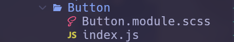
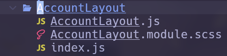
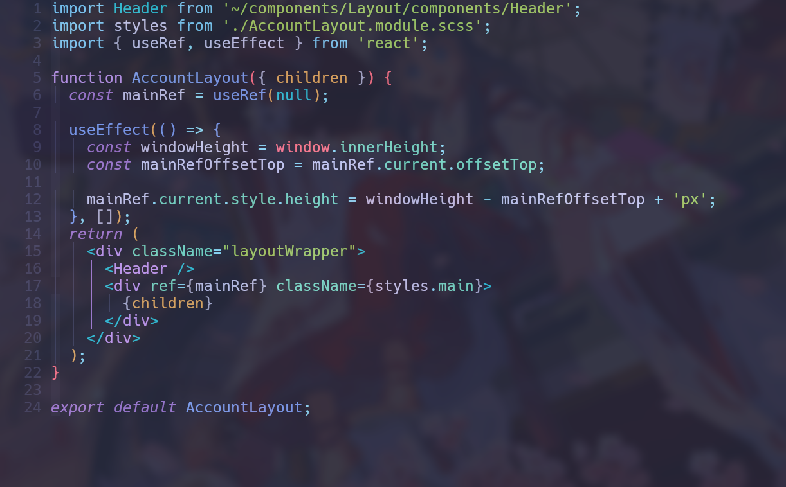
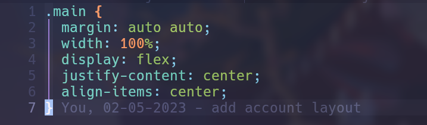
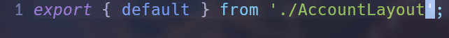

# The development branch of the dreamy farm website

## 1. Packages used in this project

| Library Name                                                                                    | Purpose                                                                             |
| ----------------------------------------------------------------------------------------------- | ----------------------------------------------------------------------------------- |
| [clsx](https://www.npmjs.com/package/clsx)                                                      | To work better with className                                                       |
| [react](https://www.npmjs.com/package/react)                                                    | Reactjs library                                                                     |
| [react-dom](https://www.npmjs.com/package/react-dom)                                            | Reactjs library                                                                     |
| [react-router-dom](https://www.npmjs.com/package/react-router-dom)                              | To routing your website                                                             |
| [customize-cra](https://www.npmjs.com/package/customize-cra)                                    | To config webpack                                                                   |
| [css-normalize](https://www.npmjs.com/package/css-normalize)                                    | Reset css and make it sync with multi browser                                       |
| [sass](https://www.npmjs.com/package/sass)                                                      | Scss syntax                                                                         |
| [prettier](https://www.npmjs.com/package/prettier)                                              | Make your code beautiful                                                            |
| [lint-stage](https://github.com/okonet/lint-staged)                                             | Run linters against staged git files and don't let hankey slip into your code base! |
| [husky](https://github.com/typicode/husky)                                                      | Husky improves your commits and more woof!                                          |
| [floating-ui](https://floating-ui.com/docs/getting-started)                                     | To make the floating component                                                      |
| [babel-plugin-module-resolver](https://github.com/tleunen/babel-plugin-module-resolver)         | Convert jsx syntax                                                                  |
| [axios](https://github.com/axios/axios)                                                         | Work with api                                                                       |
| [react-avatar-editor](https://github.com/mosch/react-avatar-editor)                             | Work with avatar                                                                    |
| [react-paginate](https://github.com/AdeleD/react-paginate)                                      | Make paginate page                                                                  |
| [react-i18next](https://react.i18next.com/)                                                     | Work with multi language                                                            |
| [i18next-browser-languagedetector](https://github.com/i18next/i18next-browser-languageDetector) | Work with multi language                                                            |
| [i18next-http-backend](https://github.com/i18next/i18next-http-backend)                         | Work with multi language                                                            |
| [validator](https://github.com/validatorjs/validator.js/)                                       | Validate data                                                                       |
| [react-toastify](https://github.com/fkhadra/react-toastify)                                     | Make toast notification                                                             |
| [redux](https://redux.js.org/usage/getting-started)                                             | Work with state                                                                     |
| [redux-toolkit](https://redux-toolkit.js.org/)                                                  | Work with state                                                                     |

## 2. How to works with this repo

- **Step 1. Clone this repo (if not yet)**

  NOTE : Ssh method (recommended)

  ```
  git clone git@github.com:sontungexpt/dreamy-farm-client.git
  ```

  NOTE : Https method (may no longer be supported from git)

  ```
  git clone https://github.com/sontungexpt/dreamy-farm-client.git
  ```

- **Step 2. Make sure you are in develop branch**

  ```
  git branch
  ```

  NOTE: If the current branch is not develop then you can use the command below to switch to develop branch

  ```
  git checkout develop
  ```

  NOTE: Make sure that you are in the folder that has the .git folder, if not
  then you can use the command cd to change the directory to the folder that has the .git folder

- **3. Create a new branch from develop branch**

  ```
  git checkout -b <your-branch-name>
  ```

  NOTE: The branch name should be related to the feature you are working on.

- **4. Start working on your branch and push it to remote when you finished some new feature or end of day**

  NOTE:For the first time you create a new branch and push it to remote do this

  ```
  git push -u origin <your-branch-name>
  ```

  After that you can push it with the shorter syntax

  ```
  git push
  ```

  NOTE: The -u flag help you to set up the upstream branch. After that, you can use git push without any flag.

- **5. Create a pull request to develop branch**

## 3. How to run this project

- **Step 1. Install mongodb**

- **Step 2. Clone backend repo**

  NOTE : Ssh method (recommended)

  ```
  git clone git@github.com:sontungexpt/dreamy-farm-server.git
  ```

  NOTE : Https method (may no longer be supported from git)

  ```
  git clone https://github.com/sontungexpt/dreamy-farm-server.git
  ```

- **Step 3. Run mongodb**

- **Step 4. Run the backend project first**

  **NOTE: Make sure installed all dependencies packages when pull from the remote if not run this command**

  ```
  npm install
  ```

  **Run project (Make sure you are in the root folder of the project)**

  ```
  npm start
  ```

- **Step 5. Run the frontend project**

  **NOTE: Make sure installed all dependencies packages when pull from the remote if not run this command**

  ```
  npm install
  ```

  **Run project (Make sure you are in the root folder of the project)**

  ```
  npm start
  ```

## 4. Some syntax rules for this project (important)

- **1. For scss module file**

  - The className should be in camelCase

    Example:

    ```
    .containerStyle {
        background-color: red;
    }
    ```

  - The file name should be begin with the name of the component

    Example: Button.module.scss

    

- **2. For js component file**

  - Import the styles from the scss module file (shouldn't code with inline
    styles)

    Example:

    ```
    import styles from "./styles.module.scss";
    ```

  - The className will be something like this: className={styles.container} or
    if you work with multi class you can use the syntax of [clsx](https://www.npmjs.com/package/clsx) library, it
    will not work if you use className="container" like in html file

  - When you want to create a component you should create a folder with the name
    of the component and put the index.js file and the scss file in it

    Example:

    **1. The component structure**

    

    **2. The [Component name].js code**

    

    **3. The [Component name].module.scss code**

    

    **4. The index.js file to export the component**

    

- **3. For localstorage**

  - Name of variable: DreamyFarm<variablename>

    Example: DreamyFarmLanguage, DreamyFarmToken, DreamyFarmUser

## 5. The authors of this project

- **1. [Tran Vo Son Tung](https://github.com/sontungexpt)**
- **2. [Pham Nguyet Quynh](https://github.com/PhamNguyetQuynh)**
- **3. [Vo Nhu Phi](https://github.com/phifin)**
